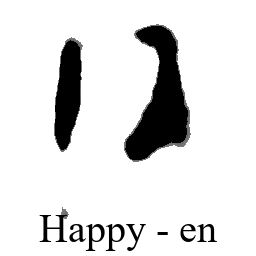
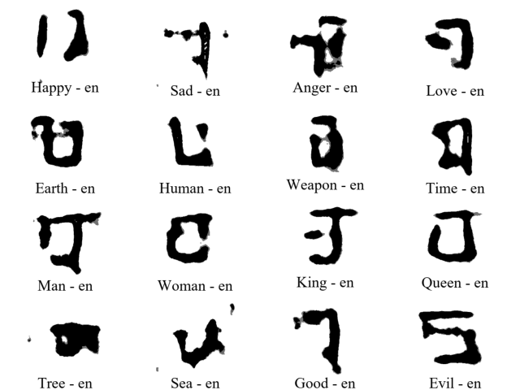

# Logogram Language Generator

This project is done within the scope of inzva AI Projects #5 August-November 2020. Check out other projects from the inzva GitHub.

  
[Record]: https://www.youtube.com/watch?v=hTKlFtC7NMw of the final project presentation (in Turkish)

  

## Readings

#### Multilingual embedding: 

* https://arxiv.org/pdf/1808.08933.pdf
* https://ai.facebook.com/tools/muse/

* http://jalammar.github.io/illustrated-word2vec/

* https://ruder.io/cross-lingual-embeddings/

##### About linear mapping between language embedings:

* https://arxiv.org/pdf/1309.4168.pdf

* https://www.aclweb.org/anthology/N15-1104.pdf

##### About fastText (pre-trained monolingual embeddings in UMWE):

* https://fasttext.cc/

* https://www.aclweb.org/anthology/Q17-1010.pdf

 

#### Generative Models:

* https://arxiv.org/pdf/1312.6114.pdf

* https://arxiv.org/pdf/1511.05644.pdf

* https://jaan.io/what-is-variational-autoencoder-vae-tutorial/

* https://towardsdatascience.com/generating-images-with-autoencoders-77fd3a8dd368

* https://theaisummer.com/Autoencoder/

* https://towardsdatascience.com/generative-variational-autoencoder-for-high-resolution-image-synthesis-48dd98d4dcc2

## Datasets

* https://github.com/brendenlake/omniglot
* https://fasttext.cc/

#### Drive Link for Docs

* https://drive.google.com/drive/folders/1md5ZayU85yaKnx0d6LM63gR1NwQNd3pX?usp=sharing

